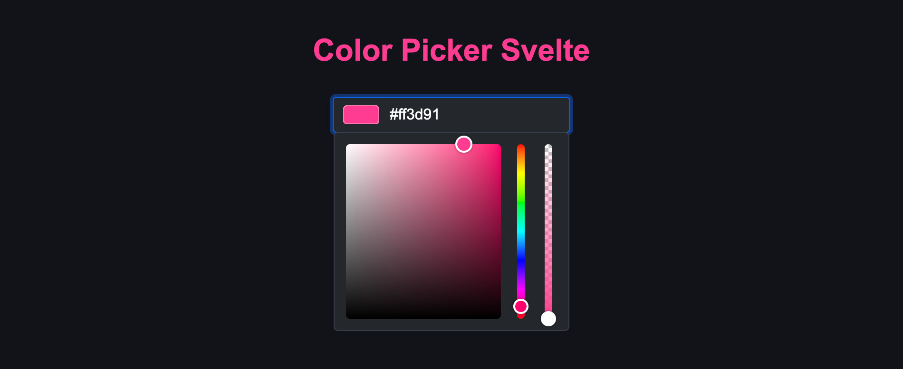

# Color Picker Svelte

[](https://npmjs.com/package/color-picker-svelte)
[](LICENSE)
[](https://npmjs.com/package/color-picker-svelte)
[](https://github.com/probablykasper/color-picker-svelte/actions/workflows/test.yml)

Color picker for Svelte

[Demo](https://color-picker-svelte.kasper.space/) • [REPL](https://svelte.dev/repl/8b00804d417b4fe89f42f90d6ed485e7?version=3.49.0)



## Install

```
npm install color-picker-svelte
```

## Usage

```svelte
<script>
  import { Color, ColorInput } from 'color-picker-svelte'

  let color = new Color('#ff3d91')
</script>

<ColorInput bind:color title="Color" />
```

## Dev instructions

### Get started

1. Install Node.js
2. Run `npm install`

### Commands

- `npm run dev`: Start in dev mode
- `npm run build`: Build
- `npm run lint`: Lint
- `npm run format`: Format

### Publish new version

1. Update `CHANGELOG.md`
2. Check for errors
    ```
    npm run lint
    ```
3. Bump the version number
    ```
    npm version --no-git-tag <version>
    ```
4. Generate the package
    ```
    npm run build:package
    ```
5. Publish the package
    ```
    npm publish ./package
    ```
6. Commit with a tag in format "v#.#.#"
7. Create GitHub release with release notes
